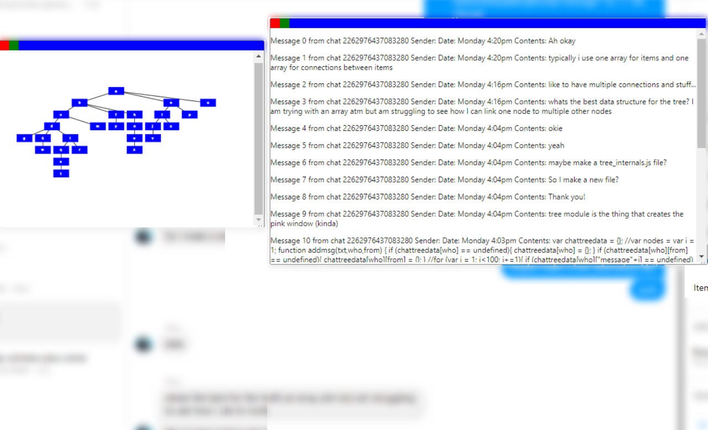

# Chat Tree
By Christie Zhu, Eliza Smedley, Lewis Watts and Steven Liu, 2019.
## What is it?
Chat Tree is a chrome extension for visualising Messenger chats in a tree-like format. 
It also happens to contain a powerful set of functions to access and listen to messages in Messenger!
## How can I download it?
For Chrome, simply head [here, to download it from the Chrome Web Store.](https://chrome.google.com/webstore/detail/chat-tree/fjejdehlndcmcciepbpielnigfnaefpc) 

## I want to contribute!

The project is hosted open source on our github [our github repository](http://github.com/acenturyandabit/chattree).

If you've noticed a bug, feel free to open an issue or submit a pull request! 

Alternatively, you can code your own module based on the template file in `modules/template.js`.

## Remaining issues

Sadly we couldn't squash all the bugs that were in the project, though we got pretty far!

The issues that remain include:

- Some sizing issues with new buttons on the sidebar: after more than 3 sidebars the window starts shifting around uncomfortably
- When users login / logout on the same device they may be able to see other users' messages
- 
